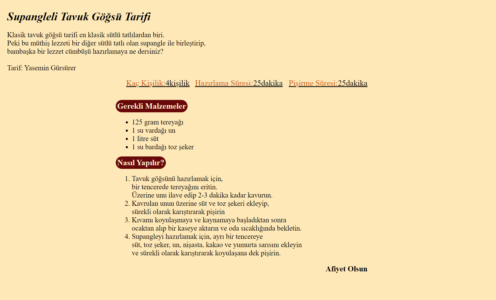

# htmlTask3
Bu repo [Kodluyoruz](https://www.kodluyoruz.org/) Front-End Eğitiminde oluşturduğumuz bir repo. İçerisinde bir adet  
README dosyası, bir adet .gitignore, bir adet de index.html barındırıyor.  
## Installation  
Öncelikle projeyi clonelayın. (Buraya sizin reponuzdan aldığınız link gelecek)  
```
git clone https://github.com/Ercanart/htmlTask3.git
```
## Usage
Projeyi cloneladıktan sonra Visul Studio Code programında açınız.  

Linux için:

```
cd htmlTask3  
code .

```
## Contributing
Pull requestler  kabul edilir. Büyük değişikler için, lütfen önce neyi değiştirmek  
istediğinizi tartışmak için konu açınız.





